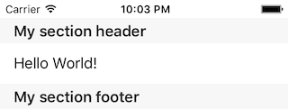

# 🧀 Raclette
[]()
[]()
[]()
[](https://github.com/cocoapods/cocoapods)
[](http://mit-license.org)
[](https://travis-ci.org/rmnblm/Raclette)


**Raclette** is a simple `UITableView` extension to add sections and rows on-the-fly.

> Raclette (pronounced _ruck-lett_ in English) is a national dish of Switzerland. The traditional dish can be described as melted cheese eaten with boiled (or roasted) potatoes with small gherkins and pickled onions.


## Contents

* [Quick Start](#quickstart)
* [Features](#features)
* [Installation](#installation)
* [Documentation](#documentation)
* [Credits](#credits)
* [License](#license)


## Quick Start

Raclette makes it easy for you to mutate your `UITableView` in seconds. 

**Example**

``` swift
tableView.isRowHighlightingEnabled = true
tableView.createSection { section in 
	section.headerTitle = "My section header"
    section.footerTitle = "My section footer"
    section.createRow { row in
      	row.configuration = { cell in
          	cell.textLabel?.text = "Hello World!"
      	}
      	row.shouldHighlight = { cell, _ in
      		return false // overrides global setting
      	}
      	row.didSelect = { cell, tableInfo in
	      	cell.textLabel?.text = "Selected"
      		tableInfo.tableView.deselectRow(at: tableInfo.indexPath, animated: true)
      	}
    }
}
```

**Result**

 


For more examples please take a look at the [example project](./RacletteExample/ViewController.swift).

## Features

* Integrates easily as an extension for your existing `UITableView`
* Support for dynamic cell height
* Support for inline closures to reduce code
* Use your own cells which inherit from `UITableViewCell`
* Reusing cells by it's identifier is magically managed for you ✨
* Redirection for `UIScrollViewDelegate` available
* No need to worry about `UITableViewDelegate` and `UITableViewDataSource` implementation


## Installation

Raclette is available through [CocoaPods](http://cocoapods.org). To install it, simply add the following line to your Podfile:

```ruby
pod 'Raclette'
```


## Documentation

### Rows

Rows can either be added to a table with or without specifying a section. If you don't specify a section, Raclette adds the row to the last section of the table. If you didn't add a section before, Raclette creates a default one for you.

``` swift
tableView.createRow { row in
	row.height = 50
}
```

### Cells

Cells are the actual UI representation of a row.

**Dynamic Height**

Dynamic height is globally **enabled** for all cells **by default**. Here's an example of how to use and benefit from the dynamic height feature (using the default `UITableViewCell` class):

```swift
tableView.createRow { row in
  	row.configuration = { cell in
  		cell.textLabel?.numberOfLines = 0
  		cell.textLabel?.text = "Very long text..."
  	}
}
```

You can turn off dynamic height for specific rows.

```swift
tableView.createRow { row in
  	row.dynamicHeight = false
}
```

You can turn dynamic row height globally.

```swift
tableView.isDynamicRowHeightEnabled = false
```

In order to get dynamic height working with customized cells, you have to get your constraints right.

Getting your constraints right is definitely the hardest and most important part of getting dynamic cell heights working with Auto Layout. If you make a mistake here, it could prevent everything else from working -- so take your time!

To determine the actual height for each row, the table view automatically asks each cell what height its contentView needs to be based on the known fixed width of the content view (which is based on the table view's width, minus any additional things like a section index or accessory view) and the auto layout constraints you have added to the cell's content view and subviews. [Source](http://stackoverflow.com/a/18746930/2058139)

**Custom Cells**

Custom cells must inherit from `UITableViewCell` and can be used like this:

```swift
class CustomCell: UITableViewCell {
	@IBOutlet weak var testLabel: UILabel!
}

tableView.createRow { (row: Row<CustomCell>) in
	row.configuration = { cell in
		cell.testLabel.text = "My Test Label"
	}
}
```

### Sections

Adding a section is as easy as adding a row.

```swift
tableView.createSection { section in
	section.headerTitle = "My Section Title"
}
```


## Credits

Raclette was heavily inspired by [Shoyu](https://github.com/yukiasai/Shoyu), [TableManager](https://github.com/Morbix/TableManager) and [Hakuba](https://github.com/nghialv/Hakuba).


## License

Raclette is released under the MIT license. See LICENSE for details.